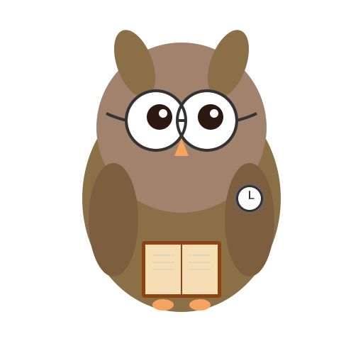

# Meeting Nudge



A cross-platform desktop app that blocks your entire screen before meetings, making it **impossible to miss them**. Built for anyone who experiences time blindness. Your clever owl companion that never misses a meeting!

## Download

| Platform | Download | Notes |
|----------|----------|-------|
| macOS | [Download .dmg](../../releases/latest) | Intel & Apple Silicon |
| Windows | [Download .exe](../../releases/latest) | Windows 10/11 |
| Linux | [Download .AppImage](../../releases/latest) | Universal |

> **Note:** On macOS, right-click → Open to bypass the "unidentified developer" warning (one-time only).

## Features

- **Full-Screen Blocking** - Unmissable alerts that cover your entire screen
- **Google Calendar Support** - Connect your Google Calendar
- **One-Click Join** - Automatically detects Zoom, Meet, Teams, and 10+ other video conferencing links
- **Multiple Reminders** - Get reminded 10, 5, and 1 minute before meetings
- **Snooze** - Need 5 more minutes? Just snooze
- **Audio Alerts** - Can't miss the sound either
- **Cross-Platform** - Works on macOS, Windows, and Linux

## Installation

### Prerequisites

- Node.js 18+ (check with `node --version`)
- npm (comes with Node.js)

### Setup Steps

```bash
# ==========================================================================
# [STEP 1] - Navigate to project directory
# ==========================================================================
cd meeting-nudge

# ==========================================================================
# [STEP 2] - Install Node.js dependencies
# ==========================================================================
npm install

# ==========================================================================
# [STEP 3] - Set up OAuth credentials (see detailed instructions below)
# ==========================================================================
export GOOGLE_CLIENT_ID="your-google-client-id"
export GOOGLE_CLIENT_SECRET="your-google-client-secret"

# ==========================================================================
# [STEP 4] - Run the application
# ==========================================================================
npm start
```

### Validate Installation

After running `npm install`, verify the installation:
```bash
# Check if electron is installed
npx electron --version
# Expected: v28.x.x or higher
```

## OAuth Setup

Before the app can access your calendars, you need to set up OAuth credentials:

### Google Calendar

1. Go to [Google Cloud Console](https://console.cloud.google.com)
2. Create a new project (or select existing)
3. Enable the **Google Calendar API**
4. Go to **APIs & Services** → **OAuth consent screen** and complete setup
5. Go to **APIs & Services** → **Credentials**
6. Click **Create Credentials** → **OAuth Client ID**
7. Select **Desktop app**
8. Click the created client to view the **Client ID** and **Client Secret**
9. Set environment variables:
   ```bash
   export GOOGLE_CLIENT_ID="your-client-id"
   export GOOGLE_CLIENT_SECRET="your-client-secret"
   ```
10. If you downloaded the JSON file, you can copy the values from it instead

## Usage

1. Start the app - it will appear in your system tray
2. Click the tray icon to open Settings
3. Connect your calendar (Google)
4. Configure your reminder preferences
5. Sync runs automatically every 5 minutes
6. That's it! The app will remind you before every meeting

### Pausing Reminders

Sometimes you need to focus without interruptions:
- Right-click the tray icon
- Select "Pause Reminders" → Choose duration
- Reminders will automatically resume after the time expires

## Building & Distribution (FREE)

### Build the App

```bash
# ==========================================================================
# [STEP 1] - Install dependencies (if not already done)
# ==========================================================================
npm install

# ==========================================================================
# [STEP 2] - Build for your platform
# ==========================================================================
npm run build:mac      # macOS (.dmg)
npm run build:win      # Windows (.exe)
npm run build:linux    # Linux (.AppImage, .deb, .rpm)

# ==========================================================================
# [STEP 3] - Find your installer
# ==========================================================================
# Built files are in the dist/ folder
open dist/   # macOS
```

### Distribution Options (All FREE)

#### Option 1: GitHub Releases

1. Create a GitHub repository
2. Build the app: `npm run build`
3. Go to your repo → Releases → Create new release
4. Upload the files from `dist/`:
   - macOS: `.dmg` file
   - Windows: `.exe` file  
   - Linux: `.AppImage` file
5. Share the release URL with users

#### Option 2: Direct Download

Host the installer files anywhere:
- Google Drive (share link)
- Dropbox
- Your personal website
- Any file hosting service

#### Option 3: Homebrew (macOS)

For advanced users, create a Homebrew Cask formula so users can install with:
```bash
brew install --cask adhd-meeting-reminder
```

See [Homebrew Cask documentation](https://docs.brew.sh/How-to-Create-and-Maintain-a-Tap) for details.

### macOS "Unidentified Developer" Warning

Since this is free distribution (not notarized), macOS shows a warning:

> "adhd-meeting-reminder" cannot be opened because it is from an unidentified developer.

**How users can bypass it (one-time only):**

1. **Right-click** the app → **Open** → Click **Open** in the dialog

Or:

1. Go to **System Preferences** → **Security & Privacy**
2. Click **Open Anyway** next to the app name

This only needs to be done once. After that, the app opens normally.

## Development

```bash
# Run in development mode with logging
npm run dev

# Build for all platforms
npm run build
```

## Supported Video Conferencing Services

The app automatically detects meeting links for:

- Zoom
- Google Meet
- Microsoft Teams
- Webex
- GoTo Meeting
- BlueJeans
- Slack Huddles
- Discord
- Whereby
- Around
- Jitsi
- Amazon Chime
- RingCentral

## Icon

The app features a clever owl icon! 🦉 The owl is reading a book and wearing glasses (smart!), plus has a clock on its wing (meeting reminder theme).

To customize the icon, edit `resources/owl-icon.svg` and regenerate the PNG files:

```bash
# Requires rsvg-convert (install via: brew install librsvg)
rsvg-convert -w 512 -h 512 resources/owl-icon.svg -o resources/owl-icon.png
```

## Project Structure

```
meeting-nudge/
├── src/
│   ├── main/                    # Main process (Node.js)
│   │   ├── index.js             # Entry point
│   │   ├── calendar/
│   │   │   ├── google.js        # Google Calendar integration
│   │   │   └── parser.js        # Meeting link parser
│   │   ├── scheduler.js         # Reminder scheduling
│   │   ├── tray.js              # System tray
│   │   └── store.js             # Settings storage
│   ├── renderer/                # Renderer process (HTML/CSS/JS)
│   │   ├── blocking/            # Full-screen blocking window
│   │   └── settings/            # Settings window
│   │   └── preload.js           # Secure IPC bridge
├── resources/                   # App icons (clever owl! 🦉)
│   ├── owl-icon.svg             # Source vector icon
│   ├── owl-icon.png             # App icon (generated from SVG)
│   ├── tray-icon.png            # System tray icon
│   └── icon.png                 # Legacy app icon
└── package.json
```

## License

MIT License - feel free to use this for personal or commercial purposes.

---

Made with care for people with time blindness
